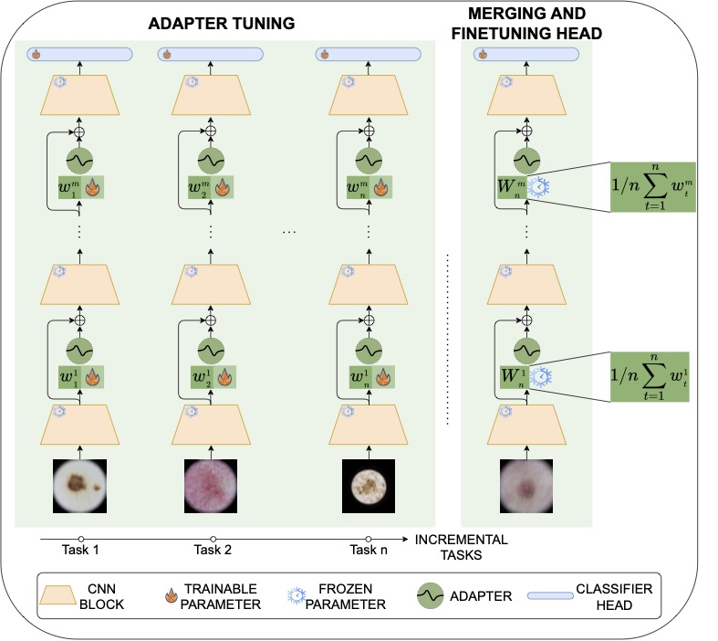

# DynaMMo: Dynamic Model Merging for Efficient Class Incremental Learning for Medical Images

[Mohammad Areeb Qazi](https://scholar.google.com/citations?user=KeyK8FQAAAAJ&hl=en),
[Ibrahim Almakky](https://scholar.google.com/citations?user=T9MTcK0AAAAJ&hl=en&oi=sra),
[Anees Ur Rehman Hashmi](https://github.com/aneesurhashmi),
[Santosh Sanjeev](https://github.com/santosh9sanjeev?tab=repositories),
[Mohammad Yaqub](https://scholar.google.com/citations?user=9dfn5GkAAAAJ)

[](https://arxiv.org/abs/2404.14099)

> **Abstract:** *Continual learning, the ability to acquire knowledge from new data while retaining previously learned information, is a fundamental challenge in machine learning. Various approaches, including memory replay, knowledge distillation, model regularization, and dynamic network expansion, have been proposed to address this issue. Thus far, dynamic network expansion methods have achieved state-of-the-art performance at the cost of incurring significant computational overhead. This is due to the need for additional model buffers, which makes it less feasible in resource-constrained settings, particularly in the medical domain. To overcome this challenge, we propose Dynamic Model Merging, DynaMMo, a method that merges multiple networks at different stages of model training to achieve better computational efficiency. Specifically, we employ lightweight learnable modules for each task and combine them into a unified model to minimize computational overhead. DynaMMo achieves this without compromising performance, offering a cost-effective solution for continual learning in medical applications. We evaluate DynaMMo on three publicly available datasets, demonstrating its effectiveness compared to existing approaches. DynaMMo offers around 10-fold reduction in GFLOPS with a small drop of 2.76 in average accuracy when compared to state-of-the-art dynamic-based approaches.*

<div align=center>
  
</div>

### CL-Pytorch: Continual Learning Framework for Pytorch
This codebase implements some SOTA continual / incremental / lifelong learning methods by PyTorch.

By the way, this is also the official repository of [DynaMMo: Dynamic Model Merging for Efficient Class Incremental Learning for Medical Images](https://arxiv.org/abs/2404.14099)

One step baseline method:

- [x] Finetune: Baseline for the upper bound of continual learning which updates parameters with data of all classes available at the same time.

Continual methods already supported:

- [x] Finetune: Baseline method which simply updates parameters when new task data arrive.(with or without memory replay of old class data.)
- [x] iCaRL: Incremental Classifier and Representation Learning. [[paper](https://arxiv.org/abs/1611.07725)]
- [x] GEM: Gradient Episodic Memory for Continual Learning. NIPS2017 [[paper](https://arxiv.org/abs/1706.08840)]
- [x] UCIR: Learning a Unified Classifier Incrementally via Rebalancing. CVPR2019[[paper](https://openaccess.thecvf.com/content_CVPR_2019/html/Hou_Learning_a_Unified_Classifier_Incrementally_via_Rebalancing_CVPR_2019_paper.html)]
- [x] BiC: Large Scale Incremental Learning. [[paper](https://arxiv.org/abs/1905.13260)]
- [x] PODNet: PODNet: Pooled Outputs Distillation for Small-Tasks Incremental Learning. [[paper](https://arxiv.org/abs/2004.13513)]
- [x] WA: Maintaining Discrimination and Fairness in Class Incremental Learning. CVPR2020 [[paper](https://arxiv.org/abs/1911.07053)]
- [x] Dark Experience for General Continual Learning: a Strong, Simple Baseline. NeurIPS [[paper](https://arxiv.org/abs/2004.07211)]
- [x] DER: Dynamically Expandable Representation for Class Incremental Learning. CVPR2021[[paper](https://arxiv.org/abs/2103.16788)]
- [x] L2P: Learning to Prompt for continual learning. CVPR2022[[paper](https://arxiv.org/abs/2112.08654)]
- [x] DualPrompt: Complementary Prompting for Rehearsal-free Continual Learning. ECCV2022 [[paper](https://arxiv.org/abs/2204.04799)]
- [x] CODA-Prompt: COntinual Decomposed Attention-based Prompting for Rehearsal-Free Continual Learning. CVPR2023 [[paper](https://arxiv.org/abs/2211.13218)]
- [x] ACL: Adapter Learning in Pretrained Feature Extractor for Continual Learning of Diseases. MICCAI2023 [[paper](https://arxiv.org/abs/2304.09042)]
- [x] DynaMMo: Dynamic Model Merging for Efficient Class Incremental Learning for Medical Images [[paper](https://arxiv.org/abs/2404.14099)]


## How to Use

### Prepare environment

```bash
conda create -n CL_Pytorch python=3.8
conda activate CL_Pytorch
pip install -r requirement.txt
```
### Add datasets and your method

Add corresponding dataset .py file to `datasets/`. It is done! The programme can automatically import the newly added datasets.

we put continual learning methods inplementations in `/methods/multi_steps` folder, pretrain methods in `/methods/pretrain` folder and normal one step training methods in `/methods/singel_steps`.

Supported Datasets:

- Natural image datasets: CIFAR-10, CIFAR-100, ImageNet100, ImageNet1K, ImageNet-R, TinyImageNet, CUB-200

- Medical image datasets: MedMNIST, path16, Skin7, Skin8, Skin40

More information about the supported datasets can be found in `datasets/`

Set `os.environ['DATA']`, where the dataset will be downloaded which is in the main.py file. You can also config your environment variables in your computer by editing `~/.bashrc` or just change the code.

### Run experiments

1. Edit the hyperparameters in the corresponding `options/XXX/XXX.yaml` file

2. Train models:

```bash
python main.py --config options/XXX/XXX.yaml
```

3. Test models with checkpoint (ensure save_model option is True before training)

```bash
python main.py --checkpoint_dir logs/XXX/XXX.pkl
```

If you want to temporary change GPU device in the experiment, you can type `--device #GPU_ID` in terminal without changing 'device' in `.yaml` config file.

## Citation

If you use **DynaMMo** or our repository in your research, please cite our paper *DynaMMo: Dynamic Model Merging for Efficient Class Incremental Learning for Medical Images*:

```
@article{qazi2024dynammo,
  title={DynaMMo: Dynamic Model Merging for Efficient Class Incremental Learning for Medical Images},
  author={Qazi, Mohammad Areeb and Almakky, Ibrahim and Hashmi, Anees Ur Rehman and Sanjeev, Santosh and Yaqub, Mohammad},
  journal={arXiv preprint arXiv:2404.14099},
  year={2024}
}
```

## References

This repository is based on the codebase provided by the authors of "ACL: Adapter Learning in Pretrained Feature Extractor for Continual Learning of Diseases. MICCAI2023" [[Link to the repo]( https://github.com/GiantJun/CL_Pytorch)]
